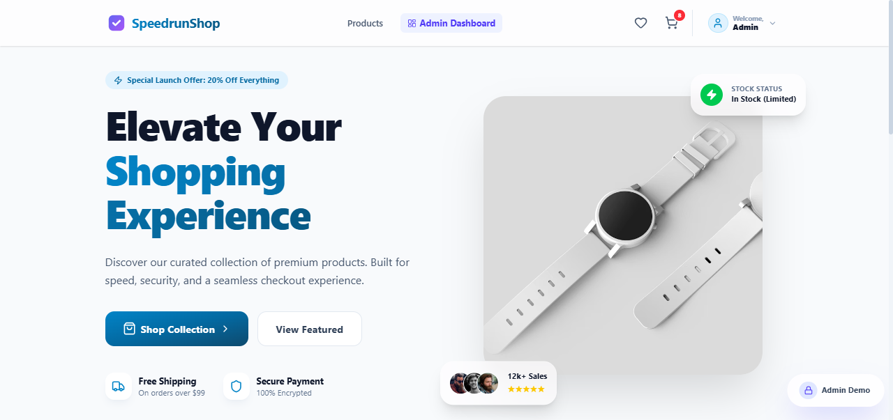
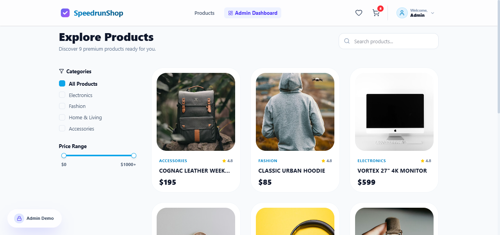
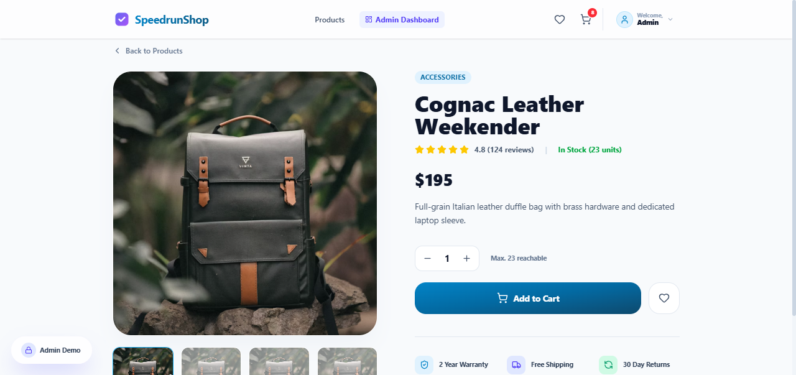
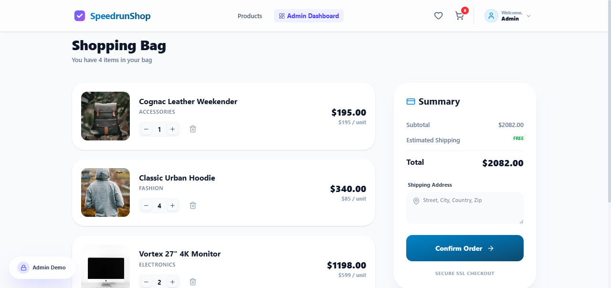
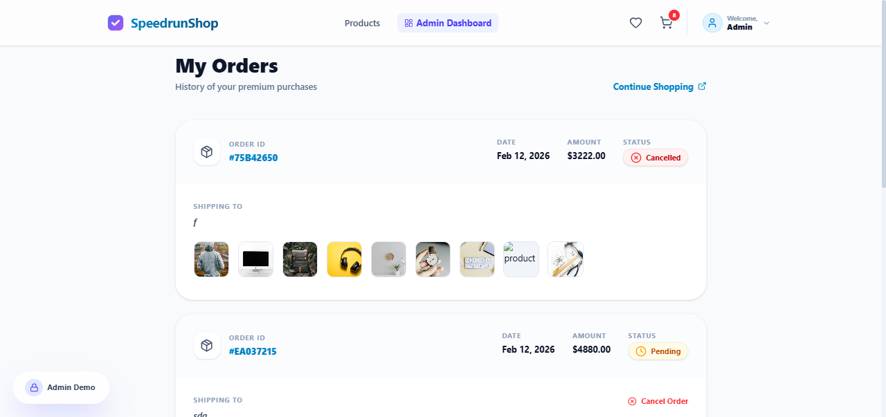
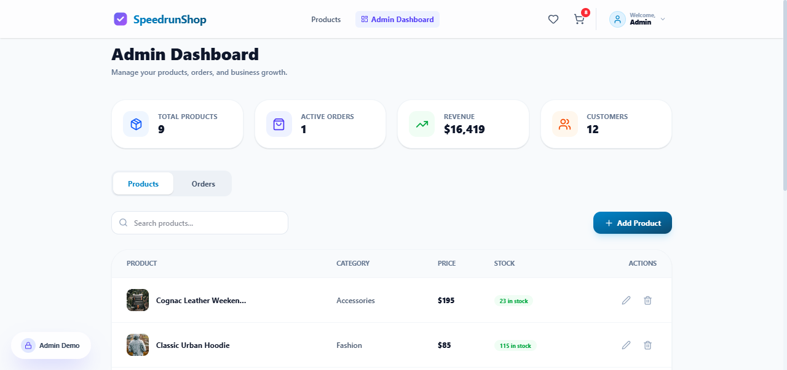

# Mini E-Commerce API

A comprehensive backend system for an online shopping platform, built with **Node.js, Express, and MongoDB**. This project implements core e-commerce functionalities including authentication, role-based access control, product management, and transactional order processing.

[](https://tiny-ecommerce.vercel.app)

---

## Tech Stack

- **Backend**: Node.js, TypeScript, Express.js
- **Database**: MongoDB with Mongoose ODM
- **Security**: JWT (Authentication), Bcrypt (Password Hashing), Helmet (Header Security), CORS, Express-Rate-Limit (Fraud Prevention)
- **Frontend**: React, Tailwind CSS, Framer Motion, Axios, React-Toastify

---

## Application Screenshots

| **Home Page** | **Product Listing** |
|:---:|:---:|
|  |  |

| **Product Details** | **Shopping Cart** |
|:---:|:---:|
|  |  |

| **Order History** | **Admin Dashboard** |
|:---:|:---:|
|  |  |

---

## Core Entities & Database Schema

### 1. User
Manages accounts and roles (`admin` or `customer`).
- `firstName`, `lastName`, `email`, `password`, `role`.

### 2. Product
Inventory items with stock management.
- `name`, `description`, `price`, `stock`, `category`, `images`.

### 3. Cart
Temporary storage for customer items before checkout.
- `user` (ref), `items` (nested array of `product` and `quantity`).

### 4. Order
Finalized purchases with transactional integrity.
- `user` (ref), `items` (referenced with historical price), `totalAmount`, `status` (`pending`, `shipped`, `delivered`, `cancelled`), `shippingAddress`.

---

## Business Rules & Architectural Decisions

- **Transactional Orders**: Used Mongoose `sessions` to ensure stock deduction and order creation are atomic. Stock is only deducted if the order is successfully committed.
- **Stock Integrity**:
    - Prevents negative inventory at both Database (Schema constraints) and Application level (pre-checkout checks).
    - Prevents adding to cart beyond available stock.
    - Returns stock to inventory upon order cancellation.
- **Fraud Prevention**: 
    - Server-side price calculation (never trust client-side totals).
    - Rate limiting on authentication routes.
    - Cancellation protection logic on the backend.
- **Role-Based Access (RBAC)**: Custom middleware `restrictTo('admin')` protects all product mutations (CRUD) and global order management.

---

## Setup Instructions

### Prerequisites
- Node.js (v16+)
- MongoDB (Local instance or Atlas URI)

### 1. Clone & Install
```bash
git clone <your-repo-url>
cd mini-ecommerce-api
npm install
cd frontend && npm install
```

### 2. Environment Variables
Create a `.env` file in the `backend` directory:
```env
PORT=5000
MONGODB_URI=your_mongodb_uri
JWT_SECRET=your_super_secret_key
JWT_EXPIRES_IN=90d
NODE_ENV=development
```

### 3. Run the Project
**Start Backend & Frontend (Root directory)**:
```bash
# From root
npm run dev
```

**Seed Database (Optional)**:
```bash
cd backend
npm run seed
```

---

## Key Features

- **Authentication & Role-Based Access** (Admin vs Customer)
- **Product Management** (Admin CRUD & Stock updates)
- **Customer Features** (Cart ops, Search, Filtering, Ordering)
- **Business Logic**:
    - Prevent ordering > stock
    - Backend total calculation
    - Stock deduction on success
    - Prevent negative inventory
    - Data consistency via Transactions

---

## Key Architectural Decisions
1. **TypeScript**: Ensures type safety across models and controllers, reducing runtime errors.
2. **RESTful Architecture**: Follows clean routing patterns and appropriate HTTP status codes (201 for creation, 204 for deletion, etc.).
3. **Global Error Handling**: Centralized middleware to catch async errors and provide consistent JSON error responses.
